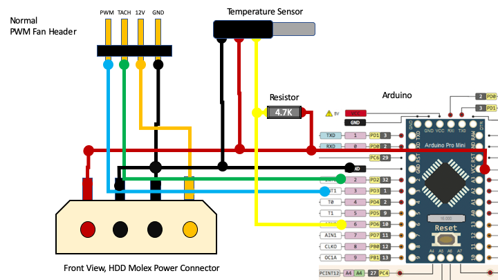
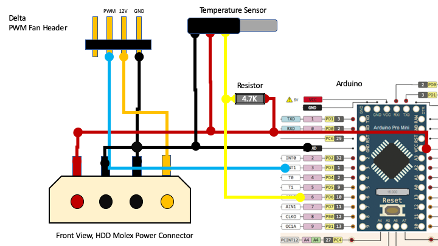

# Cooling a Tesla K80 in a Desktop

This github repo is to accompany the video here which describes my attempts to cool a used NVidia Tesla K80 card. System has been up, running and stable for a few weeks. 

Use this guide is intended for makers, use at your own risk. No warranty, MIT licensed.  

## Normal PWM Fan Control 

## Delta PWM Fan Control 

## Where to buy 

* Waterproof 1 wire temperature sensor (Arduino Pin 6) https://www.dfrobot.com/product-689.html
* Delta Fan "Delta PFC0912DE" 12V 3.72A Fan https://www.ebay.ca/sch/i.html?_from=R40&_trksid=m570.l1313&_nkw=Delta+PFC0912DE&_sacat=0

## Reference

Link to diagram of 4 pin PWM fan pinout

